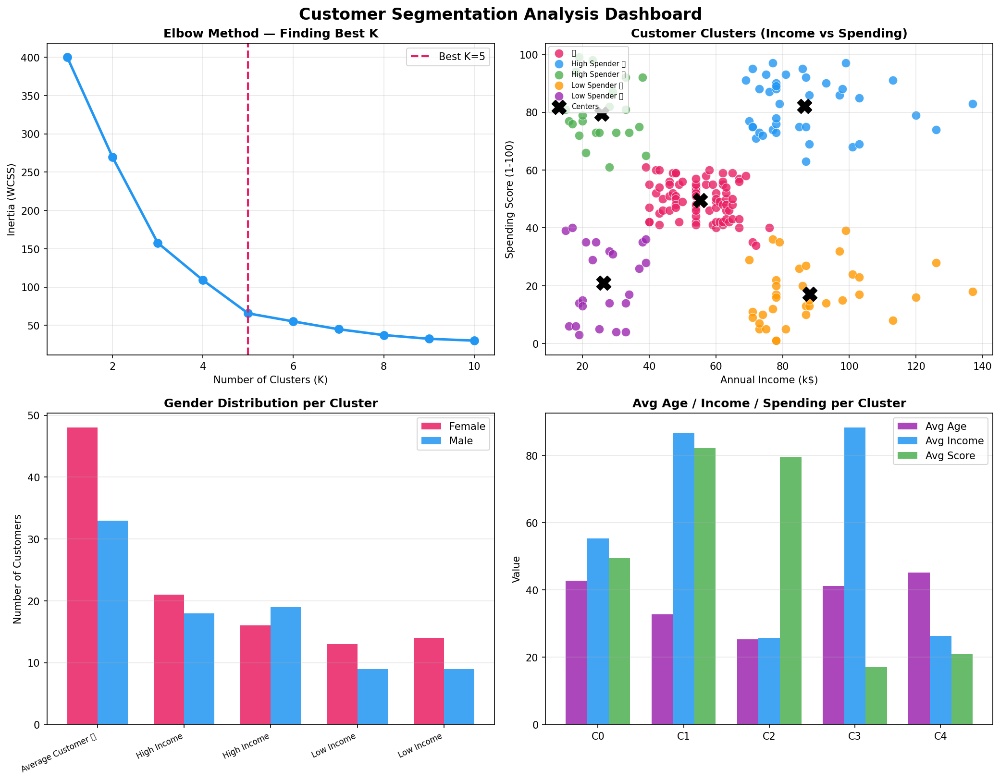

# 🛍️ Customer Segmentation Analysis

## Project Overview

This project uses Machine Learning (K-Means Clustering) to segment customers based on their annual income and spending behavior. The goal is to identify different customer groups and provide marketing recommendations.

## Objectives

- Understand customer behavior
- Identify high-value customers
- Discover spending patterns
- Support targeted marketing strategies
- Improve customer retention

## Dataset

Mall Customers Dataset

Features:
- Customer ID
- Gender
- Age
- Annual Income (k$)
- Spending Score (1-100)

## Data Preprocessing

- Missing value analysis
- Duplicate removal
- Gender encoding
- Feature scaling using StandardScaler

## Machine Learning Technique

### K-Means Clustering

- Elbow Method used to find optimal K
- K = 5 selected
- Customers grouped into 5 segments

## Dashboard Features

### Static Dashboard
- Elbow Method Analysis
- Customer Cluster Visualization
- Gender Distribution by Cluster
- Average Age, Income and Spending Analysis

### Interactive Dashboard
- Cluster Scatter Plot
- Elbow Curve
- Cluster Size Distribution
- Income & Spending Comparison

## Business Insights

- High Income, High Spender Customers
- High Income, Low Spender Customers
- Low Income, High Spender Customers
- Low Income, Low Spender Customers
- Average Customers

## Marketing Recommendations

- VIP loyalty programs
- Personalized promotions
- Discount campaigns
- Customer retention strategies

## Technologies Used

- Python
- Pandas
- NumPy
- Scikit-Learn
- Matplotlib
- Plotly

## Dashboard Preview

## Author

Yug H K
